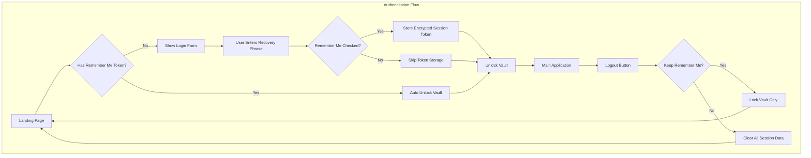
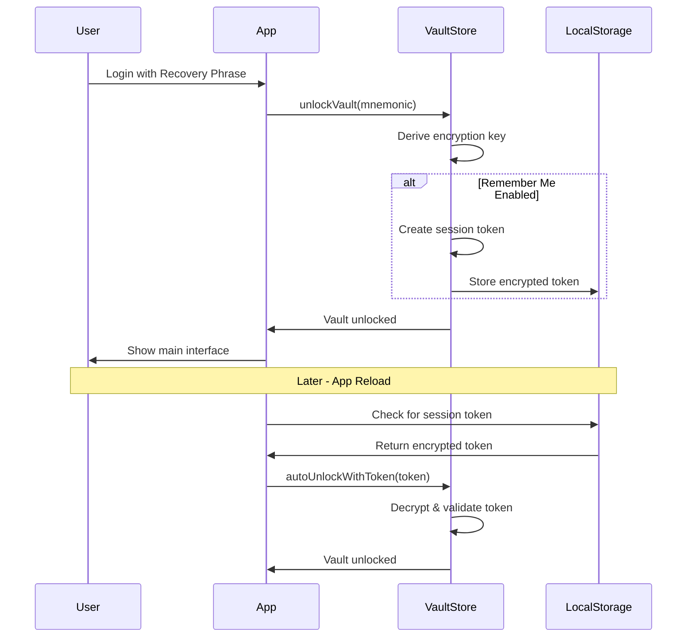

# Design Document: Auth Improvements

## Overview

Dokumen ini menjelaskan desain teknis untuk fitur logout, perbaikan tampilan login, dan fitur "Remember Me" pada aplikasi HadesNotes. Fitur-fitur ini akan meningkatkan pengalaman pengguna dalam mengakses vault terenkripsi mereka.

## Architecture

### High-Level Architecture



### Session Token Flow



## Components and Interfaces

### 1. Session Token Interface

```typescript
interface SessionToken {
  // Encrypted mnemonic for auto-unlock
  encryptedMnemonic: string;
  // Token creation timestamp
  createdAt: number;
  // Token expiration timestamp
  expiresAt: number;
  // Vault ID for validation
  vaultId: string;
  // Token version for future compatibility
  version: string;
}

interface RememberMeSettings {
  // Whether Remember Me is enabled
  enabled: boolean;
  // Duration in days (7, 30, or -1 for until logout)
  duration: 7 | 30 | -1;
}
```

### 2. Updated VaultStore Interface

```typescript
interface VaultState {
  // Existing properties...
  isVaultCreated: boolean;
  isUnlocked: boolean;
  vaultId: string | null;
  vaultHash: string | null;
  encryptionKey: Uint8Array | null;
  encryptionAlgorithm: EncryptionAlgorithm;
  currentMnemonic: string | null;
  
  // New properties for Remember Me
  rememberMeSettings: RememberMeSettings;
  hasSessionToken: boolean;
  
  // New actions
  setRememberMe: (enabled: boolean, duration?: number) => void;
  saveSessionToken: () => Promise<void>;
  clearSessionToken: () => void;
  autoUnlockWithToken: () => Promise<boolean>;
  logout: (clearRememberMe?: boolean) => void;
}
```

### 3. UI Components

#### LogoutButton Component
```typescript
interface LogoutButtonProps {
  className?: string;
  showConfirmation?: boolean;
}
```

#### LogoutConfirmationDialog Component
```typescript
interface LogoutConfirmationDialogProps {
  open: boolean;
  onOpenChange: (open: boolean) => void;
  hasRememberMe: boolean;
  onConfirm: (clearRememberMe: boolean) => void;
}
```

#### Enhanced UnlockVault Component
- Tambahan checkbox "Remember Me"
- Dropdown untuk durasi Remember Me
- Animasi dan transisi yang lebih halus
- Visual feedback yang lebih baik

## Data Models

### Session Token Storage

Session token akan disimpan di localStorage dengan enkripsi:

```typescript
// Storage key
const SESSION_TOKEN_KEY = 'hadesnotes-session-token';

// Token structure (encrypted before storage)
interface StoredSessionToken {
  token: string; // Base64 encoded encrypted SessionToken
  checksum: string; // SHA-256 hash for integrity check
}
```

### Remember Me Settings Storage

```typescript
// Stored in vaultStore persist
interface PersistedVaultState {
  isVaultCreated: boolean;
  vaultId: string | null;
  vaultHash: string | null;
  encryptionAlgorithm: EncryptionAlgorithm;
  rememberMeSettings: RememberMeSettings;
}
```

## Correctness Properties

*A property is a characteristic or behavior that should hold true across all valid executions of a system-essentially, a formal statement about what the system should do. Properties serve as the bridge between human-readable specifications and machine-verifiable correctness guarantees.*

### Property 1: Logout clears encryption key
*For any* unlocked vault state, when logout is called, the encryption key in memory SHALL be null after the operation completes.
**Validates: Requirements 1.1**

### Property 2: Session token encryption round-trip
*For any* valid mnemonic and encryption key, encrypting the mnemonic into a session token and then decrypting it SHALL produce the original mnemonic.
**Validates: Requirements 3.4**

### Property 3: Expired token rejection
*For any* session token with expiresAt timestamp in the past, autoUnlockWithToken SHALL return false and not unlock the vault.
**Validates: Requirements 3.5**

### Property 4: Token integrity validation
*For any* session token where the stored checksum does not match the computed checksum of the token data, autoUnlockWithToken SHALL reject the token and require re-authentication.
**Validates: Requirements 4.4**

### Property 5: Remember Me persistence after logout
*For any* logout operation where clearRememberMe is false, the session token SHALL remain in localStorage after logout completes.
**Validates: Requirements 1.4**

### Property 6: Complete session clear on explicit logout
*For any* logout operation where clearRememberMe is true, both the encryption key in memory AND the session token in localStorage SHALL be cleared.
**Validates: Requirements 1.3**

## Error Handling

### Session Token Errors

| Error Condition | Handling Strategy |
|----------------|-------------------|
| Token not found | Redirect to login page |
| Token expired | Clear token, redirect to login |
| Token corrupted/tampered | Clear token, show error, redirect to login |
| Decryption failed | Clear token, redirect to login |
| Vault ID mismatch | Clear token, show error, redirect to login |

### Login Errors

| Error Condition | User Feedback |
|----------------|---------------|
| Invalid mnemonic format | "Invalid recovery phrase format. Please check and try again." |
| Mnemonic doesn't match vault | "Incorrect recovery phrase. Please try again." |
| Storage quota exceeded | "Unable to save session. Please clear browser data." |

## Testing Strategy

### Unit Tests
- Test session token encryption/decryption
- Test token expiration logic
- Test logout state clearing
- Test Remember Me settings persistence

### Property-Based Tests
- Property 1: Logout encryption key clearing
- Property 2: Session token round-trip
- Property 3: Expired token rejection
- Property 4: Token integrity validation
- Property 5: Remember Me persistence
- Property 6: Complete session clear

### Integration Tests
- Full login flow with Remember Me
- Auto-unlock on app reload
- Logout with and without clearing Remember Me
- Token expiration handling

### UI Tests
- Login form validation
- Remember Me checkbox interaction
- Logout confirmation dialog
- Error message display
