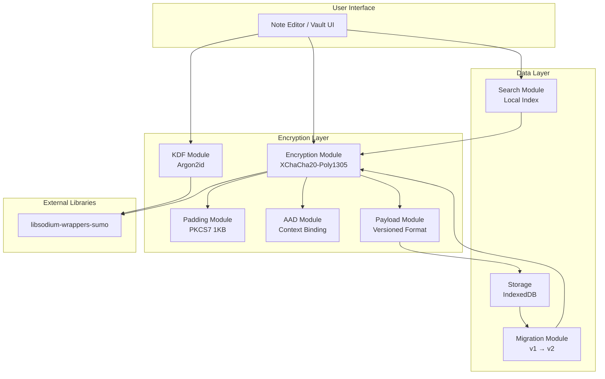

# Design Document: Enhanced Encryption System

## Overview

Dokumen ini menjelaskan desain teknis untuk peningkatan sistem enkripsi HadesNotes. Sistem baru akan menggunakan libsodium-wrappers-sumo untuk implementasi Argon2id KDF dan XChaCha20-Poly1305 AEAD encryption, dengan format payload terstruktur, enkripsi metadata lengkap, dan local-first encrypted search.

## Architecture



## Components and Interfaces

### 1. KDF Module (Key Derivation Function)

```typescript
interface KDFParams {
  algorithm: 'argon2id' | 'pbkdf2';
  salt: Uint8Array;        // 16 bytes random
  memoryKiB: number;       // 65536 (64MB) for Argon2id
  iterations: number;      // 3 for Argon2id, 600000 for PBKDF2
  parallelism: number;     // 4 for Argon2id
}

interface KDFModule {
  // Derive 256-bit key from mnemonic
  deriveKey(mnemonic: string, params: KDFParams): Promise<Uint8Array>;
  
  // Generate random salt
  generateSalt(): Uint8Array;
  
  // Get default params for algorithm
  getDefaultParams(algorithm: 'argon2id' | 'pbkdf2'): KDFParams;
  
  // Check if Argon2id is available
  isArgon2idAvailable(): Promise<boolean>;
}
```

### 2. Encryption Module

```typescript
interface EncryptionModule {
  // Encrypt with XChaCha20-Poly1305
  encrypt(
    plaintext: Uint8Array,
    key: Uint8Array,
    aad?: Uint8Array
  ): Promise<{ nonce: Uint8Array; ciphertext: Uint8Array }>;
  
  // Decrypt with XChaCha20-Poly1305
  decrypt(
    ciphertext: Uint8Array,
    nonce: Uint8Array,
    key: Uint8Array,
    aad?: Uint8Array
  ): Promise<Uint8Array>;
  
  // Generate random nonce (24 bytes)
  generateNonce(): Uint8Array;
}
```

### 3. Padding Module

```typescript
interface PaddingModule {
  // Pad to 1KB boundary using PKCS7
  pad(data: Uint8Array, blockSize?: number): Uint8Array;
  
  // Remove PKCS7 padding
  unpad(data: Uint8Array): Uint8Array;
}
```

### 4. AAD Module

```typescript
interface AADModule {
  // Create AAD from context
  createAAD(context: {
    noteId: string;
    vaultId: string;
    version?: string;
  }): Uint8Array;
  
  // Parse AAD back to context
  parseAAD(aad: Uint8Array): {
    noteId: string;
    vaultId: string;
    version?: string;
  };
}
```

### 5. Payload Module

```typescript
interface EncryptedPayloadV2 {
  v: '2.0';                    // Format version
  kdf: {
    alg: 'argon2id' | 'pbkdf2';
    salt: string;              // Base64 encoded
    mem?: number;              // Memory in KiB (Argon2id)
    iter: number;              // Iterations
    par?: number;              // Parallelism (Argon2id)
  };
  nonce: string;               // Base64 encoded, 24 bytes
  ct: string;                  // Base64 encoded ciphertext
  aad?: string;                // Base64 encoded AAD (optional)
}

// Legacy format for backward compatibility
interface EncryptedPayloadV1 {
  // Old format: base64(nonce + ciphertext)
  // No version field, detected by structure
}

interface PayloadModule {
  // Create v2 payload
  createPayload(
    ciphertext: Uint8Array,
    nonce: Uint8Array,
    kdfParams: KDFParams,
    aad?: Uint8Array
  ): EncryptedPayloadV2;
  
  // Parse payload (auto-detect version)
  parsePayload(data: string): {
    version: '1.0' | '2.0';
    payload: EncryptedPayloadV1 | EncryptedPayloadV2;
  };
  
  // Serialize to JSON string
  serialize(payload: EncryptedPayloadV2): string;
  
  // Deserialize from JSON string
  deserialize(json: string): EncryptedPayloadV2;
}
```

### 6. Note Encryption Interface

```typescript
interface EncryptedNoteV2 {
  id: string;
  vaultId: string;
  
  // Encrypted fields (EncryptedPayloadV2 JSON strings)
  encryptedTitle: string;
  encryptedContent: string;
  encryptedPreview: string;
  encryptedTags: string;           // JSON array of tags, encrypted
  encryptedNotebookId?: string;    // Encrypted if present
  encryptedTimestamps: string;     // Full precision timestamps
  
  // Plaintext metadata (minimal, for sync)
  coarseCreatedAt: string;         // Day precision: "2025-01-05"
  coarseUpdatedAt: string;         // Day precision: "2025-01-05"
  
  // Format info
  formatVersion: '2.0';
  algorithm: 'xchacha20-poly1305';
  
  // Non-sensitive fields
  isFavorite: boolean;
  section: string;
  order: number;
}

interface DecryptedNoteV2 {
  id: string;
  title: string;
  content: string;
  preview: string;
  tags: string[];
  notebookId?: string;
  createdAt: Date;
  updatedAt: Date;
  isFavorite: boolean;
  section: string;
  order: number;
}
```

### 7. Search Module

```typescript
interface SearchIndex {
  // In-memory index structure
  documents: Map<string, {
    id: string;
    title: string;
    content: string;
    tags: string[];
  }>;
  
  // Inverted index for fast lookup
  invertedIndex: Map<string, Set<string>>;
}

interface SearchResult {
  noteId: string;
  score: number;
  matches: {
    field: 'title' | 'content' | 'tags';
    snippet: string;
  }[];
}

interface SearchModule {
  // Build index from decrypted notes
  buildIndex(notes: DecryptedNoteV2[]): void;
  
  // Search with query
  search(query: string): SearchResult[];
  
  // Update single note in index
  updateNote(note: DecryptedNoteV2): void;
  
  // Remove note from index
  removeNote(noteId: string): void;
  
  // Clear index (on vault lock)
  clearIndex(): void;
}
```

### 8. Migration Module

```typescript
interface MigrationResult {
  success: boolean;
  migratedCount: number;
  failedCount: number;
  errors: { noteId: string; error: string }[];
}

interface MigrationModule {
  // Detect payload version
  detectVersion(payload: string): '1.0' | '2.0';
  
  // Migrate single note
  migrateNote(
    encryptedNote: EncryptedNote | EncryptedNoteV2,
    key: Uint8Array,
    vaultId: string,
    kdfParams: KDFParams
  ): Promise<EncryptedNoteV2>;
  
  // Bulk migrate all notes
  migrateAll(
    notes: (EncryptedNote | EncryptedNoteV2)[],
    key: Uint8Array,
    vaultId: string,
    kdfParams: KDFParams
  ): Promise<MigrationResult>;
}
```

## Data Models

### Encrypted Payload Structure (v2.0)

```json
{
  "v": "2.0",
  "kdf": {
    "alg": "argon2id",
    "salt": "base64_encoded_16_bytes",
    "mem": 65536,
    "iter": 3,
    "par": 4
  },
  "nonce": "base64_encoded_24_bytes",
  "ct": "base64_encoded_ciphertext_with_auth_tag",
  "aad": "base64_encoded_aad_optional"
}
```

### AAD Format

AAD dibuat dengan menggabungkan context fields dengan delimiter `|`:

```
noteId|vaultId|version
```

Contoh: `note-abc123|vault-def456|2.0`

### Padding Scheme

PKCS7 padding ke kelipatan 1024 bytes (1KB):

```
Original: [data bytes...]
Padded:   [data bytes...][padding bytes where each byte = padding length]
```

Jika data sudah kelipatan 1KB, tambahkan 1KB padding penuh.

### Coarse Timestamp Format

Untuk sync tanpa leak informasi detail:
- Format: `YYYY-MM-DD`
- Contoh: `2025-01-05`

Full precision timestamps disimpan terenkripsi dalam `encryptedTimestamps`:
```json
{
  "createdAt": "2025-01-05T14:30:00.000Z",
  "updatedAt": "2025-01-05T15:45:30.123Z"
}
```


## Correctness Properties

*A property is a characteristic or behavior that should hold true across all valid executions of a system—essentially, a formal statement about what the system should do. Properties serve as the bridge between human-readable specifications and machine-verifiable correctness guarantees.*

### Property 1: KDF Determinism

*For any* mnemonic string and salt, deriving the encryption key twice with the same parameters SHALL produce identical 32-byte keys.

**Validates: Requirements 1.4**

### Property 2: KDF Key Length

*For any* valid mnemonic and KDF parameters, the derived key SHALL always be exactly 32 bytes (256 bits).

**Validates: Requirements 1.3**

### Property 3: Salt Generation

*For any* vault creation, the generated salt SHALL be exactly 16 bytes and statistically random (no two salts should be identical across many generations).

**Validates: Requirements 1.2**

### Property 4: Nonce Uniqueness

*For any* sequence of N encryption operations with the same key, all N generated nonces SHALL be unique.

**Validates: Requirements 2.3**

### Property 5: Nonce Length

*For any* encryption operation, the generated nonce SHALL be exactly 24 bytes.

**Validates: Requirements 2.2**

### Property 6: Encryption Round-Trip

*For any* plaintext, key, and optional AAD, encrypting then decrypting SHALL produce the original plaintext. The nonce stored in the payload SHALL be extractable and usable for decryption.

**Validates: Requirements 2.4, 2.5**

### Property 7: Tamper Detection

*For any* valid ciphertext, modifying any byte of the ciphertext or authentication tag SHALL cause decryption to fail with an authentication error.

**Validates: Requirements 2.6**

### Property 8: Payload Structure

*For any* created v2 payload, it SHALL contain all required fields: version "2.0", kdf object with algorithm/salt/params, nonce, and ciphertext.

**Validates: Requirements 3.1, 3.2**

### Property 9: Payload Serialization Round-Trip

*For any* valid EncryptedPayloadV2 object, serializing to JSON then parsing back SHALL produce an equivalent object.

**Validates: Requirements 3.5, 3.6**

### Property 10: AAD Binding and Verification

*For any* note encryption with note_id and vault_id, the AAD SHALL contain both identifiers. Attempting to decrypt with different AAD values SHALL fail.

**Validates: Requirements 4.1, 4.2, 4.3, 4.5**

### Property 11: Metadata Encryption

*For any* stored note, the encrypted fields (title, content, preview, tags, notebookId) SHALL not be readable without the encryption key. The plaintext values SHALL not appear in the stored data.

**Validates: Requirements 5.1, 5.2, 5.3, 5.4, 5.5**

### Property 12: Timestamp Handling

*For any* stored note, the coarse timestamps SHALL be day-precision only (YYYY-MM-DD format), while full-precision timestamps SHALL be recoverable from the encrypted payload.

**Validates: Requirements 5.6, 5.7**

### Property 13: Padding Round-Trip

*For any* plaintext data, padding then unpadding SHALL produce the original data. The padded size SHALL be a multiple of 1024 bytes.

**Validates: Requirements 6.1, 6.2, 6.3**

### Property 14: Search Index Consistency

*For any* note added or updated in the index, searching for terms in that note's title, content, or tags SHALL return that note in the results.

**Validates: Requirements 7.3, 7.5**

### Property 15: Migration Version Handling

*For any* encrypted payload (v1 or v2), the migration module SHALL correctly detect the version and decrypt using the appropriate algorithm. Re-encrypting SHALL produce v2 format.

**Validates: Requirements 8.1, 8.2, 8.3**

### Property 16: Migration Result Reporting

*For any* bulk migration operation, the result SHALL accurately report the count of successfully migrated notes and failed notes.

**Validates: Requirements 8.6**

### Property 17: Session Token Encryption

*For any* session token, the stored mnemonic SHALL be encrypted with a separate session key, not the vault encryption key.

**Validates: Requirements 9.4**

## Error Handling

### Encryption Errors

| Error Type | Condition | Handling |
|------------|-----------|----------|
| `InvalidKeyError` | Key is not 32 bytes | Throw with descriptive message |
| `InvalidNonceError` | Nonce is not 24 bytes | Throw with descriptive message |
| `AuthenticationError` | AEAD tag verification failed | Return null, log warning |
| `AADMismatchError` | AAD doesn't match expected | Return null, log warning |

### KDF Errors

| Error Type | Condition | Handling |
|------------|-----------|----------|
| `InvalidMnemonicError` | Mnemonic fails BIP39 validation | Throw with descriptive message |
| `Argon2UnavailableError` | Argon2id not supported | Fall back to PBKDF2, log warning |
| `InsufficientMemoryError` | Cannot allocate for Argon2id | Fall back to PBKDF2, log warning |

### Migration Errors

| Error Type | Condition | Handling |
|------------|-----------|----------|
| `UnsupportedVersionError` | Payload version not recognized | Log error, skip note, continue |
| `DecryptionFailedError` | Cannot decrypt legacy data | Log error, skip note, continue |
| `CorruptedPayloadError` | Payload structure invalid | Log error, skip note, continue |

### Error Response Format

```typescript
interface CryptoError {
  code: string;
  message: string;
  details?: Record<string, unknown>;
  recoverable: boolean;
}
```

## Testing Strategy

### Dual Testing Approach

Testing akan menggunakan kombinasi:
1. **Unit Tests**: Untuk contoh spesifik, edge cases, dan error conditions
2. **Property-Based Tests**: Untuk memverifikasi properties universal across all inputs

### Property-Based Testing Configuration

- **Library**: fast-check (TypeScript property-based testing library)
- **Minimum iterations**: 100 per property test
- **Tag format**: `Feature: enhanced-encryption, Property {number}: {property_text}`

### Test Categories

#### Unit Tests
- Specific encryption/decryption examples with known values
- Edge cases: empty strings, very large data, special characters
- Error conditions: invalid keys, corrupted data, wrong AAD
- Integration points between modules

#### Property Tests
- All 17 correctness properties implemented as property-based tests
- Random input generation for:
  - Mnemonics (valid BIP39 words)
  - Plaintext data (arbitrary strings and binary)
  - Note metadata (titles, content, tags)
  - AAD contexts (note_id, vault_id combinations)

### Test File Structure

```
src/lib/__tests__/
├── crypto.test.ts           # Unit tests for crypto module
├── crypto.property.test.ts  # Property tests for crypto module
├── padding.test.ts          # Unit tests for padding
├── padding.property.test.ts # Property tests for padding
├── payload.test.ts          # Unit tests for payload
├── payload.property.test.ts # Property tests for payload
├── search.test.ts           # Unit tests for search
├── search.property.test.ts  # Property tests for search
└── migration.test.ts        # Unit + property tests for migration
```

### Coverage Requirements

- All public functions must have unit tests
- All correctness properties must have property-based tests
- Edge cases explicitly tested:
  - Empty input
  - Maximum size input (1MB+)
  - Unicode and special characters
  - Boundary conditions for padding
