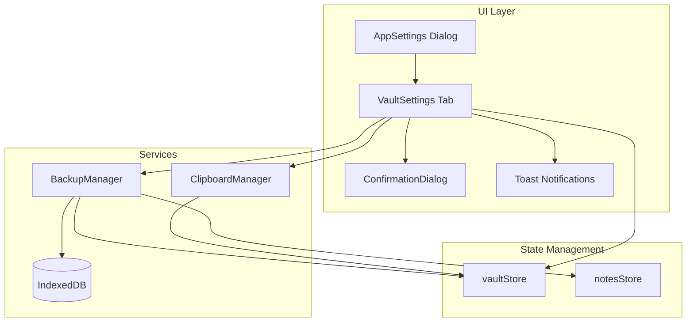

# Design Document: Vault Settings

## Overview

Vault Settings adalah komponen React yang menyediakan antarmuka lengkap untuk mengelola vault terenkripsi. Komponen ini akan ditambahkan sebagai tab baru di dialog AppSettings yang sudah ada, dengan fokus pada keamanan dan UX yang intuitif.

Fitur utama:
- Copy mnemonic phrase dengan safeguard keamanan
- Backup dan restore data vault terenkripsi
- Delete account dengan konfirmasi multi-step
- Display informasi vault (status, algorithm, last backup)

## Architecture



## Components and Interfaces

### VaultSettings Component

```typescript
interface VaultSettingsProps {
  onClose?: () => void;
}

interface VaultSettingsState {
  showMnemonic: boolean;
  mnemonicRevealTimer: number | null;
  deleteConfirmStep: 0 | 1 | 2;
  deleteConfirmInput: string;
  isProcessing: boolean;
  lastBackupDate: string | null;
}
```

### BackupManager Service

```typescript
interface BackupManager {
  createBackup(): Promise<VaultBackup>;
  downloadBackup(backup: VaultBackup): void;
  parseBackupFile(file: File): Promise<VaultBackup>;
  restoreBackup(backup: VaultBackup, key: Uint8Array): Promise<RestoreResult>;
  getBackupPreview(backup: VaultBackup, key: Uint8Array): Promise<BackupPreview>;
}

interface BackupPreview {
  noteCount: number;
  notebookCount: number;
  tagCount: number;
  backupDate: string;
  algorithm: EncryptionAlgorithm;
}

interface RestoreResult {
  success: boolean;
  error?: string;
  restoredCounts?: {
    notes: number;
    notebooks: number;
    tags: number;
  };
}
```

### ClipboardManager Service

```typescript
interface ClipboardManager {
  copyToClipboard(text: string): Promise<boolean>;
  clearClipboard(): Promise<void>;
  scheduleClipboardClear(delayMs: number): void;
}
```

### ConfirmationDialog Component

```typescript
interface ConfirmationDialogProps {
  open: boolean;
  onOpenChange: (open: boolean) => void;
  title: string;
  description: string;
  confirmText?: string;
  cancelText?: string;
  variant?: 'default' | 'danger';
  requireInput?: string; // If set, user must type this to confirm
  onConfirm: () => void;
  onCancel?: () => void;
}
```

## Data Models

### VaultBackup (Extended)

```typescript
interface VaultBackup {
  version: string;           // "1.0"
  vaultId: string;           // Vault identifier
  algorithm: EncryptionAlgorithm;
  exportDate: string;        // ISO date string
  encryptedData: string;     // Encrypted JSON of all vault data
  checksum?: string;         // SHA-256 hash for integrity verification
}

interface VaultBackupData {
  notes: DecryptedNote[];
  notebooks: Notebook[];
  tags: Tag[];
  settings?: AppSettings;
}
```

### LocalStorage Keys

```typescript
const STORAGE_KEYS = {
  LAST_BACKUP_DATE: 'hadesnotes-last-backup',
  CLIPBOARD_CLEAR_TIMER: 'hadesnotes-clipboard-timer',
};
```

## Correctness Properties

*A property is a characteristic or behavior that should hold true across all valid executions of a system—essentially, a formal statement about what the system should do. Properties serve as the bridge between human-readable specifications and machine-verifiable correctness guarantees.*

### Property 1: Vault Action Buttons State

*For any* vault action button (Copy Mnemonic, Create Backup, Restore Backup, Delete Account), the button should be enabled if and only if the vault is unlocked.

**Validates: Requirements 1.1, 1.5, 2.1, 2.7, 3.1, 4.1**

### Property 2: Backup Round-Trip Consistency

*For any* valid vault data, creating a backup (encrypting) and then restoring it (decrypting with the same key) should produce data equivalent to the original.

**Validates: Requirements 2.4, 3.3, 3.5**

### Property 3: Delete Confirmation Input Validation

*For any* input string in the delete confirmation dialog, the delete action should only proceed if and only if the input exactly matches "DELETE" (case-sensitive).

**Validates: Requirements 4.4**

### Property 4: Vault State After Deletion

*For any* successful delete operation, the vault state should be reset (isVaultCreated=false, isUnlocked=false, encryptionKey=null) and all data in IndexedDB should be cleared.

**Validates: Requirements 4.5, 4.6**

### Property 5: Vault Info Display Accuracy

*For any* vault state, the displayed vault information (status, encryption algorithm, vault ID preview) should accurately reflect the current vault store state.

**Validates: Requirements 5.2, 5.3, 5.6**

### Property 6: Destructive Actions Require Confirmation

*For any* destructive action (delete account, restore backup that overwrites data), the action should only execute after explicit user confirmation through the confirmation dialog.

**Validates: Requirements 6.3**

### Property 7: Operations Abort on Vault Lock

*For any* ongoing vault operation, if the vault becomes locked during the operation, the operation should be cancelled and an appropriate error message should be displayed.

**Validates: Requirements 6.5**

## Error Handling

### Error Types

```typescript
enum VaultSettingsError {
  VAULT_LOCKED = 'VAULT_LOCKED',
  CLIPBOARD_FAILED = 'CLIPBOARD_FAILED',
  BACKUP_CREATION_FAILED = 'BACKUP_CREATION_FAILED',
  BACKUP_INVALID = 'BACKUP_INVALID',
  BACKUP_WRONG_KEY = 'BACKUP_WRONG_KEY',
  BACKUP_CORRUPTED = 'BACKUP_CORRUPTED',
  RESTORE_FAILED = 'RESTORE_FAILED',
  DELETE_FAILED = 'DELETE_FAILED',
}
```

### Error Messages

```typescript
const ERROR_MESSAGES: Record<VaultSettingsError, string> = {
  VAULT_LOCKED: 'Vault is locked. Please unlock to continue.',
  CLIPBOARD_FAILED: 'Failed to copy to clipboard. Please try again.',
  BACKUP_CREATION_FAILED: 'Failed to create backup. Please try again.',
  BACKUP_INVALID: 'Invalid backup file format.',
  BACKUP_WRONG_KEY: 'This backup was created with a different vault. Cannot decrypt.',
  BACKUP_CORRUPTED: 'Backup file is corrupted or incomplete.',
  RESTORE_FAILED: 'Failed to restore backup. Your data has not been modified.',
  DELETE_FAILED: 'Failed to delete vault. Please try again.',
};
```

### Error Handling Strategy

1. All async operations wrapped in try-catch
2. Errors logged to console with context (without sensitive data)
3. User-friendly error messages via toast notifications
4. Operations are atomic where possible (restore either fully succeeds or fully fails)

## Testing Strategy

### Unit Tests

Unit tests akan fokus pada:
- Komponen rendering berdasarkan vault state
- Validation logic (delete confirmation input)
- Error handling paths
- Service function behavior

### Property-Based Tests

Property-based tests menggunakan **fast-check** library untuk TypeScript:

```typescript
import fc from 'fast-check';

// Property 2: Backup Round-Trip
fc.assert(
  fc.property(
    fc.record({
      notes: fc.array(arbitraryNote),
      notebooks: fc.array(arbitraryNotebook),
      tags: fc.array(arbitraryTag),
    }),
    async (vaultData) => {
      const key = await deriveKeyFromMnemonic(generateMnemonic());
      const backup = await createVaultBackup(vaultData, key, 'test-vault');
      const restored = await restoreVaultBackup(backup, key);
      return deepEqual(vaultData, restored);
    }
  ),
  { numRuns: 100 }
);
```

### Test Configuration

- Minimum 100 iterations per property test
- Each property test tagged with: **Feature: vault-settings, Property {N}: {description}**
- Mock browser APIs (clipboard, file download) for unit tests
- Use in-memory IndexedDB mock for data persistence tests

